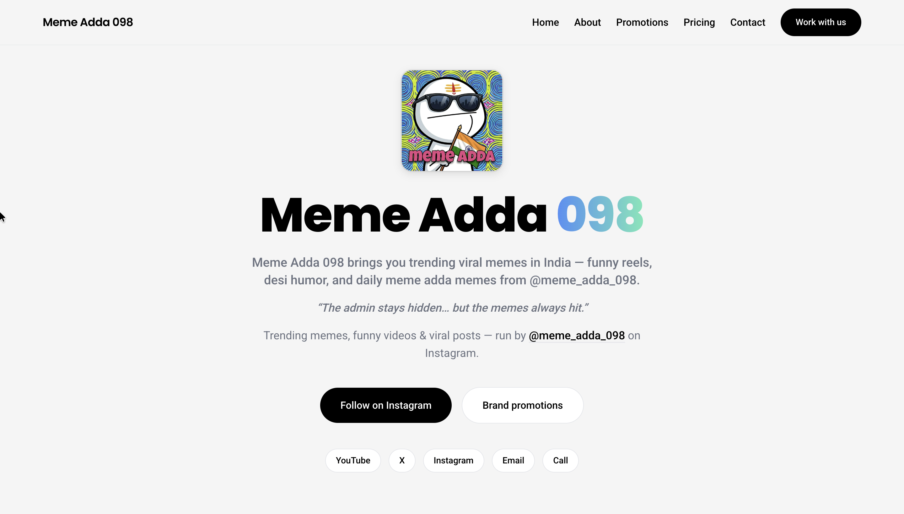

# Meme Adda 098

Meme Adda 098 is a viral meme platform built for sharing and exploring the latest, trending, and Instagram memes. The application is designed to be extremely fast, fully responsive, and SEO-optimized.

## Preview



## Tech Stack

- **Core Framework:** React (v18)
- **Build Tool:** Vite
- **Styling:** Tailwind CSS & PostCSS
- **Animations:** Framer Motion
- **Routing:** React Router (v7)

## Features

- **Meme Feeds:** Browse trending, latest, and Instagram-specific memes.
- **Partner Ads / Sponsored Apps:** Integrated section showcasing partner applications:
  - **YorWatch** (Free movies, TV series & anime)
  - **ONEFLIX** (Free movies & series in HD)
  - **RE:Anime** (Watch anime online free)
  - **PlayUp Live** (Live cricket & sports streaming)
- **Responsive Layout:** Optimized for mobile, tablet, and desktop views.
- **SEO & Performance:** High-performance static pre-rendering, automatic sitemap generation, and SEO meta tag configurations.

## Getting Started

### Installation

Clone the repository and install dependencies:

```bash
npm install
```

### Development Server

Run the local development server:

```bash
npm run dev
```

### Build for Production

Build the application for production deployment (includes sitemap generation, TypeScript checks, and pre-rendering):

```bash
npm run build
```
